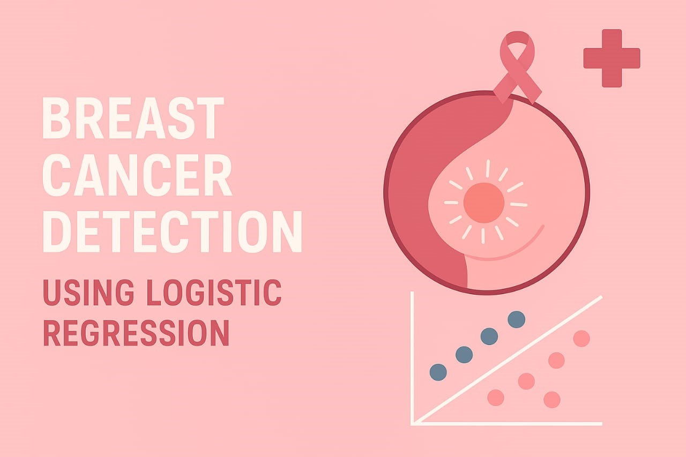

<!-- Banner Image -->

  

<h1 align="center">Breast Cancer Detection Model</h1>

<i>Empowering early diagnosis through data science</i>

---

## 🧠 About the Project

This project is focused on building a machine learning model that predicts whether a breast tumor is benign or malignant using real-world data. Early diagnosis is critical — and this AI-powered system supports doctors in making quicker, more informed decisions.

---

## 🚀 Workflow

  
  <strong>→ Data Collection</strong>
  
  <strong>→ Preprocessing</strong>
  
  <strong>→ Model Training</strong>
  
  <strong>→ Prediction</strong>

---

## ⚙️ Technologies Used

- Python (Google Collab)
- scikit-learn
- pandas, numpy
- matplotlib, seaborn

---

## 📊 Results

- **Random Forest**: 98% accuracy  
- **SVM**: 97%  
- **Logistic Regression**: 96%  
- Feature visualizations and prediction comparisons included.

---
## Public Awareness
<section style="font-family: Arial, sans-serif; padding: 2rem; background: #fff0f5; border-radius: 12px; box-shadow: 0 2px 10px rgba(0,0,0,0.1);">
  <h2 style="text-align: center; color: #c2185b;">🎗 Breast Cancer Awareness</h2>
  

    Every 1 in 8 women is diagnosed with breast cancer in her lifetime.
    Early detection can make all the difference.
  

  

    

      
    

    

      <ul style="font-size: 1rem; line-height: 1.6; color: #555;">
        <li>✅ Regular self-examinations can detect abnormalities early.</li>
        <li>✅ Mammograms are vital for women over 40.</li>
        <li>✅ Support and encourage breast cancer screening awareness.</li>
        <li>✅ AI and data models can assist in early detection and diagnostics.</li>
      </ul>
    

  

  

    Together, let's fight breast cancer through technology and awareness. 💗
  

</section
---

## 🙋‍♂️ About Me

**Sanskar Gupta**  
BCA Student | AI & Data Science Enthusiast  
[LinkedIn](https://www.linkedin.com/in/sanskar-gupta-942973249/) • [GitHub](https://github.com/Sanskarpyml)

---

  Made with ❤️ to support early breast cancer diagnosis.

